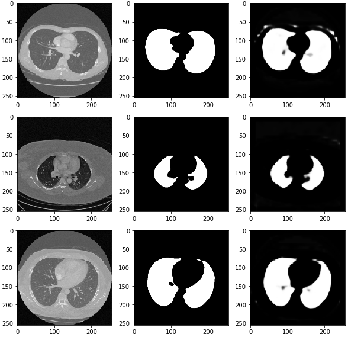

# CT Data(.tif)를 이용한 Image Segmentation 튜토리얼


## 참고 사이트(Kaggle)
 * https://www.kaggle.com/kmader/finding-lungs-in-ct-data

## 목적
해당 튜토리얼은 Kaggle에서 Sample로 간단하게 Lung을 찾는 연습을 하는 것 입니다.<br>
제공된 Data는 2d images와 2d masks가 제공이 되고 있습니다.<br>
dicom 파일과 tiff 파일 모두 의료영상에서 많이 사용하는 확장자인걸로 알고 있습니다.<br>

그러나, 이런 데이터파일 class수가 많아지고, 파일 개수도 많아지게 되면 나중에 파일을 이동하거나 보관할때 중간에 파일 하나가 없어지게 된다면, 그것은 training에 있어서 문제가 발생될 수 있습니다.<br>
그래서 슬라이스된 2d 이미지를 묶어서 하나의 파일로 만드는 nii로 3d_image로도 데이터셋이 제공이 됩니다.<br>

우리는 이 데이터들을 U-Net 알고리즘을 사용해서 Image Segmentation에 맞게 train을 시켜줍니다.<br>
또한 제공된 데이터는 train데이터입니다.<br이 데이터를 train_test_split를 통해서 train과 valid 그리고 test로 분리를 해주었습니다.<br>
test로 분리를 해줄때는 test_label 데이터는 사용하지 않았습니다.<br>

> &nbsp;&nbsp;&nbsp; 이 튜토리얼에서는 제공된 CSV파일에 적혀져 있는 mask pixel 값을 참고 안하고 오직 mask된 image로만 label로 참고를 하게 됩니다.<br> 

## 튜토리얼 코드
### 2D 이미지
- Image_mask_tutorial
  - tif 파일을 이용해서 제공된 mask와 image를 numpy_array로 변환하는 튜토리얼 입니다.
- model_Lung_segmentation
  - [Image_mask_tutorial] 에서 변환해준 numpy_array를 이용해서 tf.data.Dataset을 애용해 data pipe-line을 구축하고 numpy_array를 tensor로 변환하여 Model[U-Net]에 넣어주고 최종적으로 test images를 넣어줄때 mask를 자동적으로 씌어주는지 확인하는 코드입니다.
### 3D 이미지
- NIFTI_preprocessing
  - 3D 이미지 형식인 NIFTI 파일(nii)을 압축해놓은 nii.gz 데이터를 load하고 시각화 시켜주는 튜토리얼 입니다.
    - nii 파일을 load할때는 [nibabel](https://nipy.org/nibabel/) 라이브러리를 사용합니다.
    - scikits-images의 [montage](https://scikit-image.org/docs/0.7.0/api/skimage.util.montage.html) 모듈을 사용했습니다.<br> 이 모듈은, 3차원 입력 array에서 동일한 모양의 2차원 이미지의 앙살블을 나타내는 모듈이다.

#### Training data
- train Image : 216
- train Mask : 216
- total original data : 267

#### Test data
- Test Image : 3

#### Validation data
- train Image : 21
- train Mask : 21

#### 데이터셋 구조

```
|-- train
      |-- 2d_images # 각각 폴더별 ID
            |--  ID_0000_Z_0142.tif
            |--  ID_0067_Z_0238.tif
            |--  ID_0134_Z_0137.tif
             ...
      |-- 2d_masks 
            |-- ID_0000_Z_0142.tif
            |-- ID_0067_Z_0238.tif
            |-- ID_0134_Z_0137.tif
             ...
      |-- 3d_images
            |-- IMG_0002.nii.gz
            |-- IMG_0059.nii.gz
            |-- MASK_0002.nii.gz
             ...
```

## 결과
### 2D Image에 대한 결과
```
Test loss: 0.028305495157837868
Test accuracy: 0.9700826
```
### 3D Image에 대한 결과
```
```
<div align="center">
  
</div>